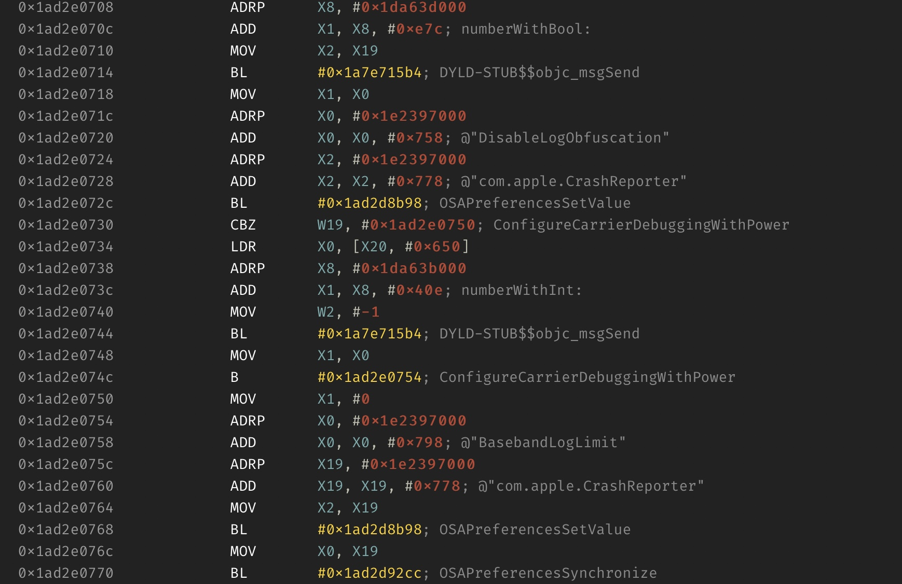
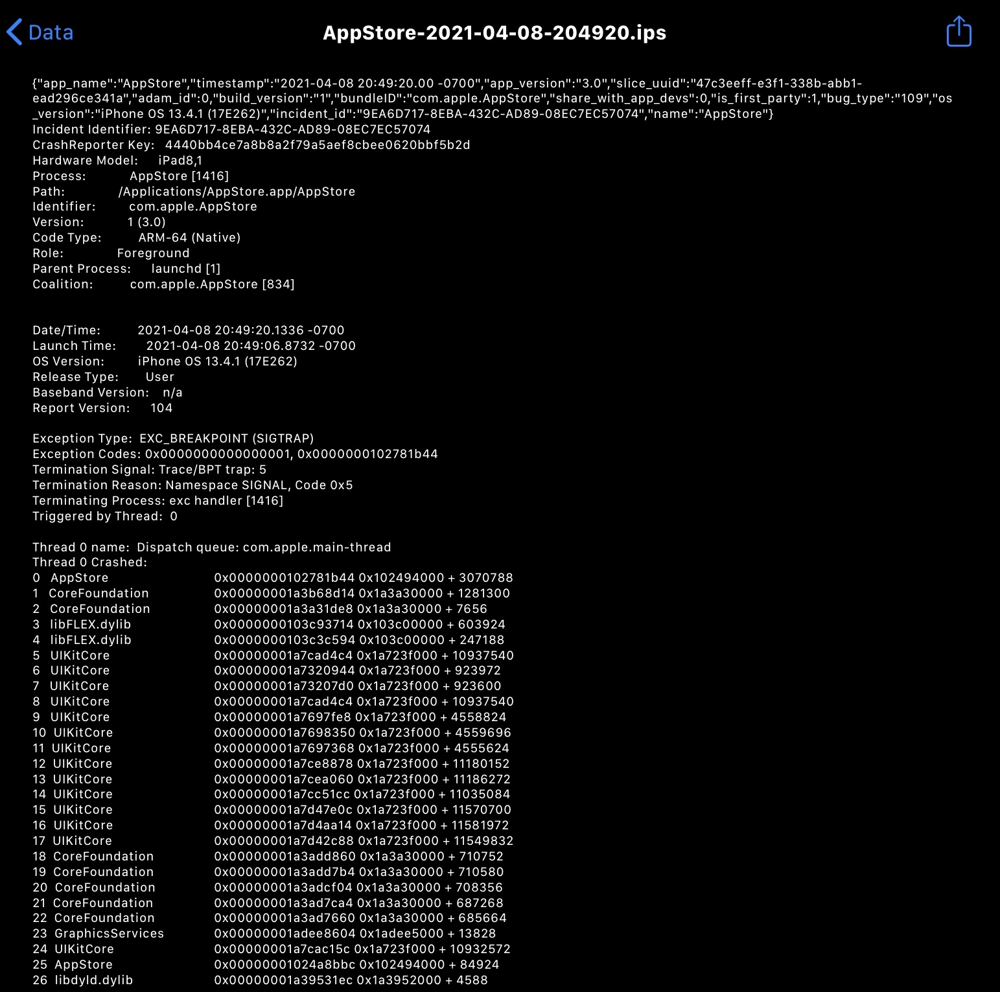
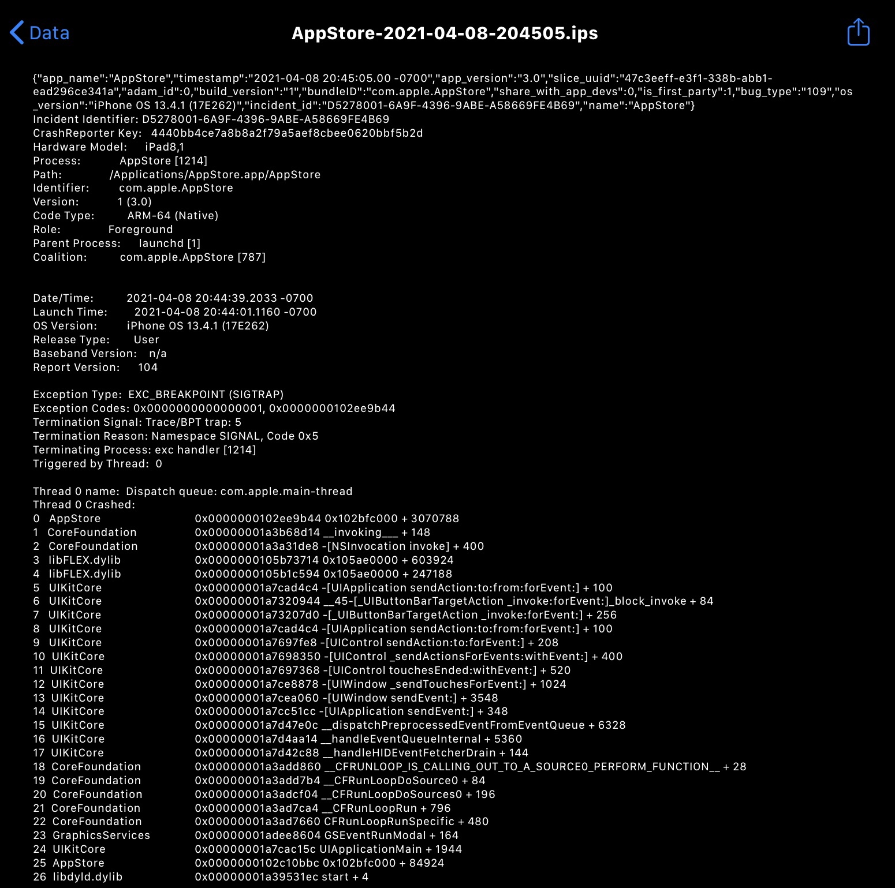

# Symbolicator

This package enables the ability to natively symbolicate all of your crash logs. 

## Usage

Install the package and reboot. Done.

Now all of your crash reports located in the settings app should be symbolicated automatically without any hassle 

## Side by side example

https://twitter.com/insan1d/status/1357556364285931520?s=21

## No way.

Yes way. 

## What? How? 

I was is exploring any possible methods to symbolicating iOS crash logs, I felt like there had to be a simpler implementation than the already-existent 3rd party methods, but was slightly doubtful I would find anything of substance, really because far more talented individuals had undoubtedly explored this.

Although, I got lucky, in a disassembly session I discovered the a global domain titled “com.apple.CrashReporter“, and after quickly double checking, nothing with that domain existed within NSUserDefaults or within any particular file on disk. 



The preference value for “DisableLogObfuscation“ was revealed within that disassembly, and I after a mass search for any constants containing “Symbolicate“, I was able to find that “SymbolicateCrashLogs“ was a fit.

The package itself just installs the final property list to iOS‘s global preference directory (/var/mobile/Library/Preferences), but in case you‘d rather just add the plist manually, here is an XML representation of the final file:

```xml
<?xml version="1.0" encoding="UTF-8"?>
<!DOCTYPE plist PUBLIC "-//Apple//DTD PLIST 1.0//EN" "http://www.apple.com/DTDs/PropertyList-1.0.dtd">
<plist version="1.0">
<dict>
	<key>DisableLogObfuscation</key>
	<true/>
	<key>SymbolicateCrashes</key>
	<true/>
</dict>
</plist>
```

## What to expect

Until I find out what processes have to be killed for this to take effect, you’re gonna have to reboot your device or run ldrestart, after that, crash logs should be symbolicated. Here is a side-by-side representation of the differences you should expect. I used FLEX to formulate these crash logs, they are both identical attempts to push a view controller that does not exist. 

**Before**


**After**



